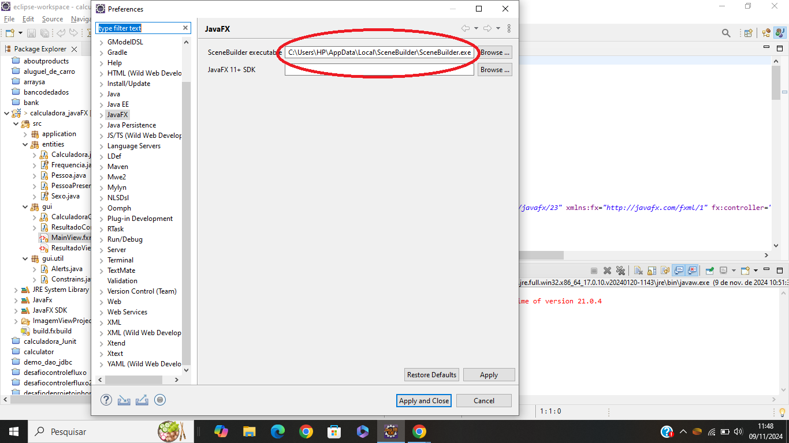
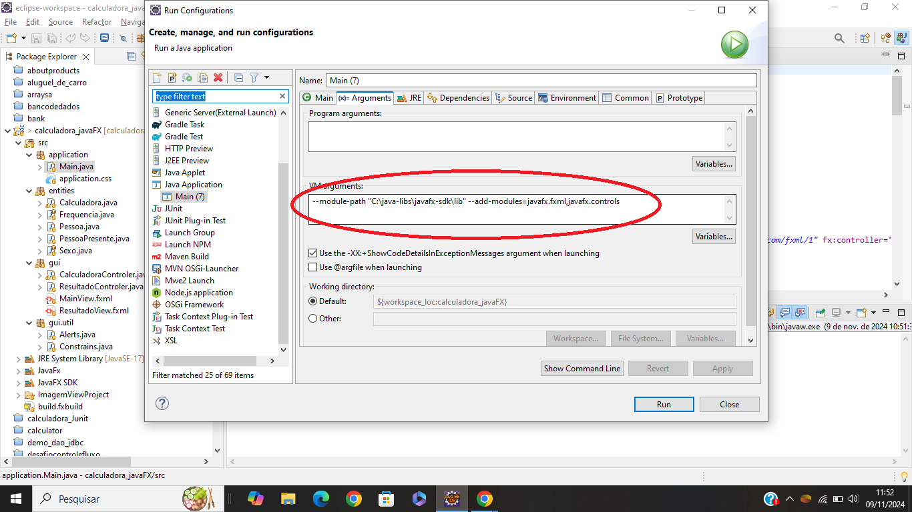

# Calculadora TMB e IMC

## Índice
- [Sobre o Projeto](#sobre-o-projeto)
- [Tecnologias Utilizadas](#tecnologias-utilizadas)
- [Como Executar o Projeto](#como-executar-o-projeto)

## Sobre o Projeto

> Uma calculadora feita para calcular o seu indice de massa corporal e também a taxa metábolica basal, para que você possa usar nas suas dietas e ter métricas de saúde.

## Tecnologias Utilizadas
- Java (JDK-17)
- JavaFx
- Scenebuilder

## Como Executar o Projeto

> Você vai precisar ter instalado na sua máquina uma JDK, um SDK (JavaFX), uma IDE e uma SceneBuilder (O app que usaremos para editar os arquivos FXML). Após a instalação de todos os apps e Sistemas, você precisará configurar.

### Configurando o Caminho do SceneBuilder

> Na sua de IDE (A que eu uso é a Eclipse) " Window > Preference > JavaFX: SceneBuilder executable: (O caminho dos arquivos para execução do scenebuilder).
>
>

### Run As configurations

> Na sua IDE com o click direito do mouse em Run as vá em: Run As configuration > Arguments(Aba): VMarguments: você deve colocar o modulo path (O caminho de instalação do javaFx).
>
>

